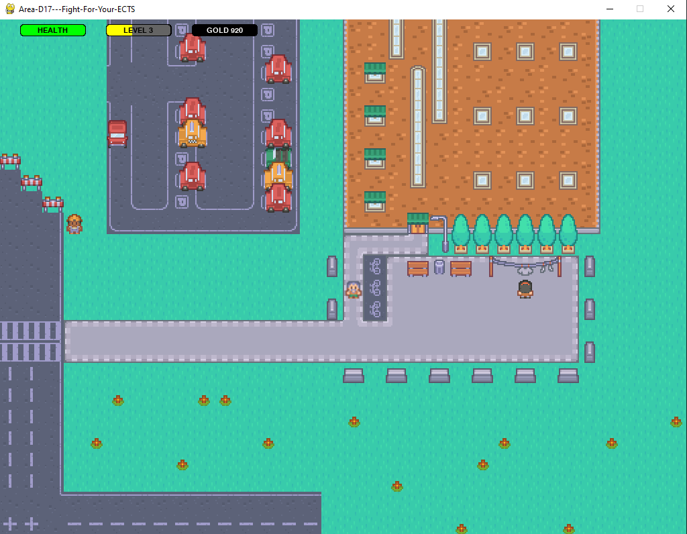
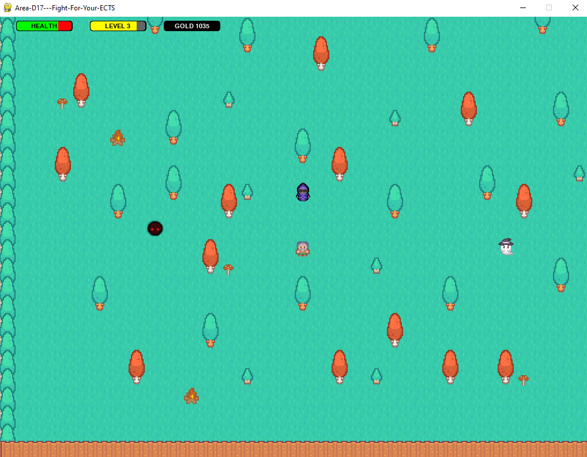
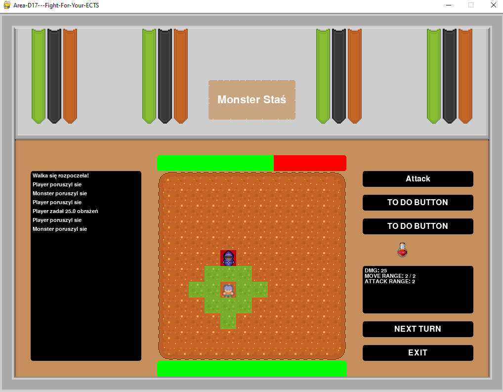
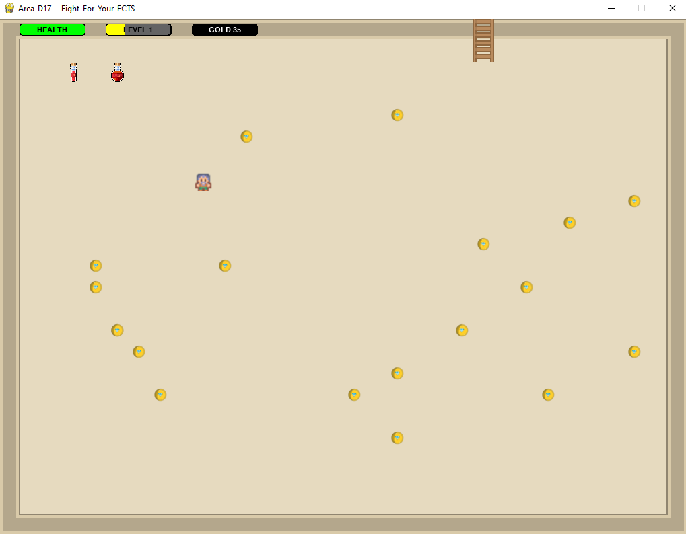
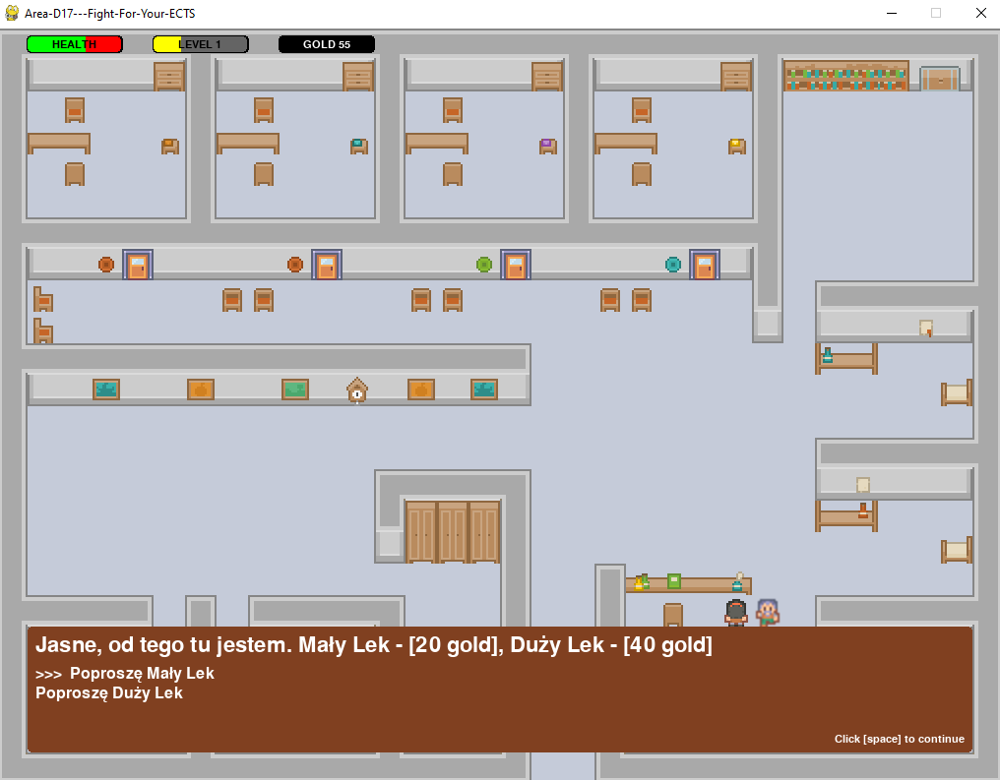

# Area-D17---Fight-For-Your-ECTS

### Autorzy:
- Kamil Delekta
- Przemysłam Kolaszyński

### Wykorzystane technologie
- [x] Python
- [x] Pygame

# Opis
Gra przenosi nas w wirtualny świat Miasteczka Studenckiego AGH. W trakcie rozgrywki walczymu o swoję ECTS.
Zdobywamy doświadczenie, które następnie przekłada się na nasze obecne umiejętności.

# Sterowanie
| Funkcja                          | Klawisz     |
|:-------------:                   |:-----:      |
| Poruszanie na mapie              | Strzałki, WASD    |
| Poruszanie na arenie             | Myszka      |
| Rozpoczynanie dialogu            | e           |
| Wybranie ścieżki dialogowej      | w,s         |
| Zatwierdzenie ścieżki dialogowej | Enter       |
| Opuszczenie ścieżki dialogowej   | Spacja      |
| Rozpoczęcie walki                | q           |
| Zebranie przedmiotu              | c           |

# Jak grać

### Główna mapa

<ul>

<li> Poruszasz się strzałkami. </li>

<li> Wchodzisz do budynku nachodząc na drzwi. </li>

</ul>

### Las

<ul>

<li> Potwory znajdują się w lesie. </li>

<li> Rozpoczynasz walkę "q". </li>

</ul>

### Arena

<ul>

<li> Klikając Playera wyświetlają się możliwe ruchy.</li>
  
<li> Gdy potwór jest w zasięgu ataku, podswietla się na czerwono i możesz go zaatakować. </li>

<li> W czasie walki możesz się uzdrowić używając Magicznych Mikstur. </li>

</ul>

### Secret Room

<ul>

<li> Raz na całą grę możesz wejść do Secret Room'u. Gdy to zrobisz, wrota do Secret Room'u znikają bezpowrotnie. </li>
  
<li> Potrzebujesz klucza by wejść do Secret Room'u. Możesz go zdobyć od pewnego Starca. </li>

<li> Secret Room pojawia się w losowym miejscu. </li>

<li> Zbierasz przedmioty "c". </li>

</ul>

### Szpital

<ul>

<li> Gdy umrzesz na arenie, tracisz połowę pieniądzy i pojawiasz się w szpitalu. </li>

<li> Możesz się uleczyć, kupując lek od Lekarza. </li>

<li> Rozpoczynasz dialog "e". </li>

</ul>

# Miłego grania!!!